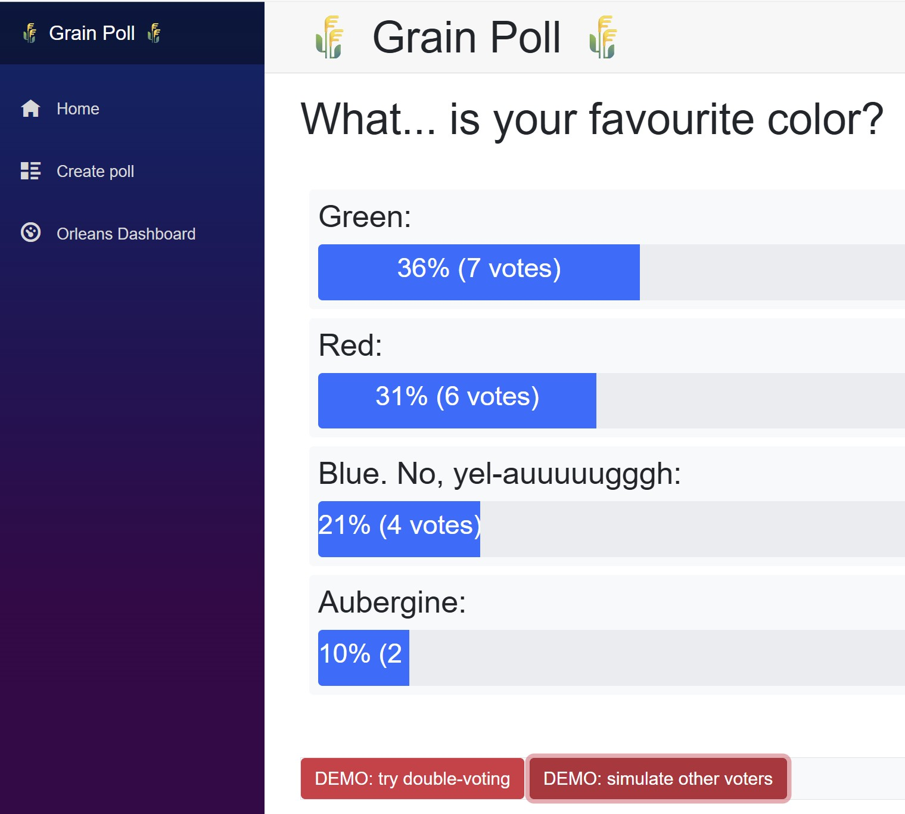
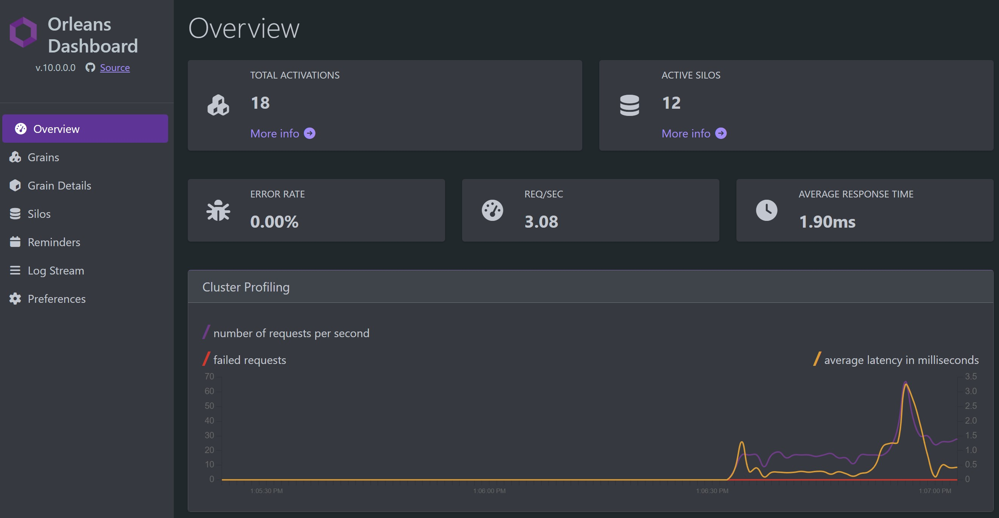
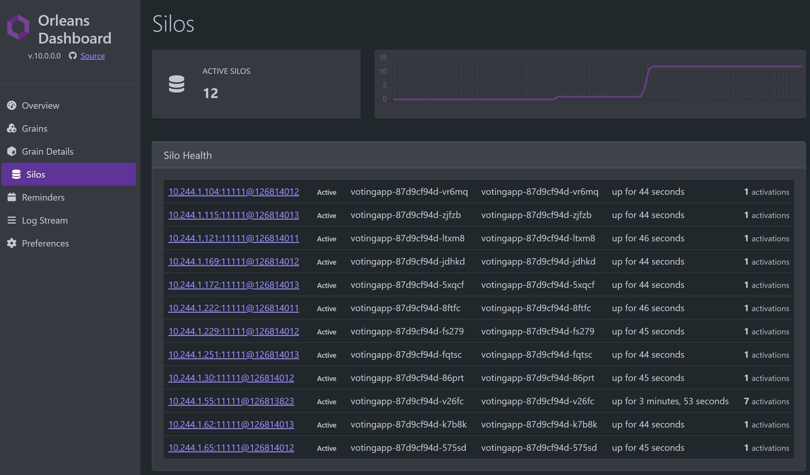

---
languages:
- csharp
products:
- dotnet
- dotnet-orleans
- azure-kubernetes-service
page_type: sample
name: "Orleans Voting sample app on Kubernetes"
urlFragment: "orleans-voting-sample-app-on-kubernetes"
description: "An Orleans sample demonstrating a voting app deployed to Azure Kubernetes Service (AKS)."
---

# Orleans Voting Sample App on Kubernetes



This is an [Orleans](https://github.com/dotnet/orleans) sample application that demonstrates deployment to Azure Kubernetes Service (AKS). The application is a simplistic Web app for voting on a custom set of options. The application uses [.NET Generic Host](https://docs.microsoft.com/dotnet/core/extensions/generic-host) to co-host [ASP.NET Core](https://docs.microsoft.com/aspnet/core) Blazor Server and Orleans as well as the [Orleans Dashboard](https://github.com/OrleansContrib/OrleansDashboard) together in the same process.



The Web app uses Blazor Server components which call into Orleans grains for real-time voting updates.

In AKS, the application uses Kubernetes pod discovery for Orleans clustering and Redis for grain state persistence. It also uses pods directly as silos, with silo-to-silo communication over the cluster network.



## Upgrades from Original Sample

This sample has been upgraded from the original Microsoft sample:

| Component | Original | Current |
| --------- | -------- | ------- |
| .NET | 7.0 | **8.0** |
| Microsoft.Orleans.Server | 7.x | **10.0.0-rc.2** |
| Microsoft.Orleans.Hosting.Kubernetes | 7.x | **10.0.0-rc.2** |
| Microsoft.Orleans.Clustering.Redis | N/A (used community packages) | **10.0.0-rc.2** |
| Microsoft.Orleans.Persistence.Redis | N/A (used community packages) | **10.0.0-rc.2** |
| Microsoft.Orleans.Dashboard | 7.x | **10.0.0-rc.2** |

**Key Changes:**

- Upgraded to .NET 8.0 LTS
- Migrated to official Microsoft Orleans Redis packages (previously used community `Orleans.Clustering.Redis` and `Orleans.Persistence.Redis`)
- Updated Orleans Dashboard integration to use `/dashboard` route instead of separate port
- Reorganized Kubernetes manifests into separate files in the `k8s/` folder for better maintainability
- Added build and deployment automation scripts

## Prerequisites

- [.NET 8.0 SDK](https://dotnet.microsoft.com/download/dotnet/8.0) or later
- [Docker Desktop](https://www.docker.com/products/docker-desktop)
- [Azure CLI](https://docs.microsoft.com/cli/azure/install-azure-cli)
- [kubectl](https://kubernetes.io/docs/tasks/tools/)
- An Azure subscription with an AKS cluster and Azure Container Registry (ACR)

## Project Structure

```text
voting-app-k8s/
├── Program.cs              # Application entry point with Orleans configuration
├── Dockerfile              # Multi-stage Docker build
├── Voting.csproj           # Project file with Orleans 10.0 packages
├── Grains/                 # Orleans grain implementations
│   ├── PollGrain.cs        # Poll state and voting logic
│   ├── VoteGrain.cs        # Individual vote tracking
│   └── UserAgentGrain.cs   # User session management
├── Pages/                  # Blazor Razor pages
│   ├── Index.razor         # Home page
│   ├── Poll.razor          # Poll voting UI
│   └── PollEditor.razor    # Poll creation/editing
├── Data/                   # Services
│   ├── PollService.cs      # Poll management service
│   └── DemoService.cs      # Demo data generation
└── k8s/                    # Kubernetes manifests
    ├── 1.run-local.ps1     # Local development script
    ├── 2.redis.yaml        # Redis deployment and service
    ├── 3.voting-app-reqs.yaml  # Service and RBAC configuration
    ├── 4.build-push-image.ps1  # Build and deploy script
    └── 5.voting-app-deployment.yaml  # Application deployment
```

## Running Locally

### Option 1: Using the Script

```powershell
cd k8s
.\1.run-local.ps1
```

### Option 2: Manual Command

```powershell
dotnet run -c Release -- --environment Development --urls http://localhost:5024
```

Once the application starts:

- **Voting App**: <http://localhost:5024>
- **Orleans Dashboard**: <http://localhost:5024/dashboard>

## Building and Deploying to AKS

### Step 1: Provision Azure Resources

Before deploying, ensure you have the following Azure resources:

- A resource group
- An Azure Container Registry (ACR)
- An Azure Kubernetes Service (AKS) cluster with ACR integration

```powershell
# Example: Create resources (customize names as needed)
$resourceGroup = "rg-voting-app"
$location = "westus"
$clusterName = "aks-voting-app"
$containerRegistry = "acrvotingapp"

az login

# Create resource group
az group create --name $resourceGroup --location $location

# Create ACR
az acr create --name $containerRegistry --resource-group $resourceGroup --sku Standard

# Create AKS cluster with ACR integration
az aks create `
    --resource-group $resourceGroup `
    --name $clusterName `
    --node-count 3 `
    --attach-acr $containerRegistry `
    --generate-ssh-keys

# Get AKS credentials
az aks get-credentials --resource-group $resourceGroup --name $clusterName
```

### Step 2: Deploy Redis

Redis is used for Orleans clustering and grain state persistence.

```powershell
kubectl apply -f k8s/2.redis.yaml
```

**`k8s/2.redis.yaml`** creates:

- A Redis Deployment with the `mcr.microsoft.com/oss/bitnami/redis:6.0.8` image
- A ClusterIP Service named `redis` on port 6379

### Step 3: Deploy RBAC and Service

Orleans requires pod discovery permissions for Kubernetes clustering.

```powershell
kubectl apply -f k8s/3.voting-app-reqs.yaml
```

**`k8s/3.voting-app-reqs.yaml`** creates:

- A LoadBalancer Service exposing ports 80 and 443
- A Role granting `get`, `watch`, `list` permissions on pods
- A RoleBinding associating the default service account with the role

### Step 4: Build, Push, and Deploy

Use the provided script to build the Docker image, push to ACR, and deploy:

```powershell
cd k8s
.\4.build-push-image.ps1
```

Or manually:

```powershell
$resourceGroup = "your-resource-group"
$containerRegistry = "your-acr-name"

$acrLoginServer = $(az acr show --name $containerRegistry --resource-group $resourceGroup --query loginServer --output tsv)
az acr login --name $containerRegistry

# Build and push
docker build . -t "$acrLoginServer/orleans/votingapp"
docker push "$acrLoginServer/orleans/votingapp"

# Deploy
kubectl apply -f k8s/5.voting-app-deployment.yaml
kubectl rollout restart deployment/votingapp
```

### Step 5: Verify Deployment

Watch the pods start up:

```powershell
kubectl get pods --watch
```

Get the external IP address:

```powershell
kubectl get service votingapp
```

The `EXTERNAL-IP` value is the public endpoint for your application.

## Kubernetes Manifests Key elements

### in `k8s/3.voting-app-reqs.yaml` => Required RBAC for `Microsoft.Orleans.Hosting.Kubernetes`

```yaml
kind: Role
apiVersion: rbac.authorization.k8s.io/v1
metadata:
  name: pod-reader
rules:
- apiGroups: [""]
  resources: ["pods"]
  verbs: ["get", "watch", "list"]
---
kind: RoleBinding
apiVersion: rbac.authorization.k8s.io/v1
metadata:
  name: pod-reader-binding
subjects:
- kind: ServiceAccount
  name: default
roleRef:
  kind: Role
  name: pod-reader
  apiGroup: rbac.authorization.k8s.io
```

### in `k8s/5.voting-app-deployment.yaml` - Key configuration in Kubernetes `deployment` for `Microsoft.Orleans.Hosting.Kubernetes`

```yaml
apiVersion: apps/v1
kind: Deployment
metadata:
  name: votingapp
spec:
  replicas: 1
  template:
    metadata:
      labels:
        app: votingapp
        orleans/serviceId: votingapp    # Orleans service identifier
        orleans/clusterId: votingapp    # Orleans cluster identifier
    spec:
      containers:
      - name: main
        image: your-acr.azurecr.io/orleans/votingapp:latest
        ports:
        - containerPort: 8080           # HTTP
        - containerPort: 11111          # Orleans silo-to-silo
        env:
        # Orleans cluster configuration
        - name: ORLEANS_SERVICE_ID
          valueFrom:
            fieldRef:
              fieldPath: metadata.labels['orleans/serviceId']
        - name: ORLEANS_CLUSTER_ID
          valueFrom:
            fieldRef:
              fieldPath: metadata.labels['orleans/clusterId']
        # Pod identity for Orleans clustering
        - name: POD_NAMESPACE
          valueFrom:
            fieldRef:
              fieldPath: metadata.namespace
        - name: POD_NAME
          valueFrom:
            fieldRef:
              fieldPath: metadata.name
        - name: POD_IP
          valueFrom:
            fieldRef:
              fieldPath: status.podIP
        # Graceful shutdown
        - name: DOTNET_SHUTDOWNTIMEOUTSECONDS
          value: "120"
        # Redis connection
        - name: REDIS
          value: "redis"
      terminationGracePeriodSeconds: 180
  minReadySeconds: 60
  strategy:
    rollingUpdate:
      maxUnavailable: 0
      maxSurge: 1
```

## Orleans Configuration

The `Program.cs` configures Orleans differently based on the environment:

```csharp
builder.Host.UseOrleans((ctx, orleansBuilder) =>
{
    if (ctx.HostingEnvironment.IsDevelopment())
    {
        // Local development: in-memory clustering and storage
        orleansBuilder
            .UseLocalhostClustering()
            .AddMemoryGrainStorage("votes");
    }
    else
    {
        // Kubernetes: Use pod discovery and Redis
        orleansBuilder.UseKubernetesHosting();

        var redisAddress = $"{Environment.GetEnvironmentVariable("REDIS")}:6379";
        orleansBuilder.UseRedisClustering(options => 
            options.ConfigurationOptions = ConfigurationOptions.Parse(redisAddress));
        orleansBuilder.AddRedisGrainStorage("votes", options => 
            options.ConfigurationOptions = ConfigurationOptions.Parse(redisAddress));
    }

    orleansBuilder.AddDashboard();
});
```

## NuGet Packages

| Package | Version | Purpose |
| ------- | ------- | ------- |
| Microsoft.Orleans.Server | 10.0.0-rc.2 | Core Orleans server functionality |
| Microsoft.Orleans.Hosting.Kubernetes | 10.0.0-rc.2 | Kubernetes pod discovery and hosting |
| Microsoft.Orleans.Clustering.Redis | 10.0.0-rc.2 | Redis-based cluster membership |
| Microsoft.Orleans.Persistence.Redis | 10.0.0-rc.2 | Redis-based grain state persistence |
| Microsoft.Orleans.Dashboard | 10.0.0-rc.2 | Web-based Orleans monitoring dashboard |

## Resources

- [Orleans Documentation](https://learn.microsoft.com/dotnet/orleans/)
- [Orleans on Kubernetes](https://learn.microsoft.com/dotnet/orleans/deployment/kubernetes)
- [Azure Kubernetes Service (AKS)](https://learn.microsoft.com/azure/aks/)
- [Orleans GitHub Repository](https://github.com/dotnet/orleans)
